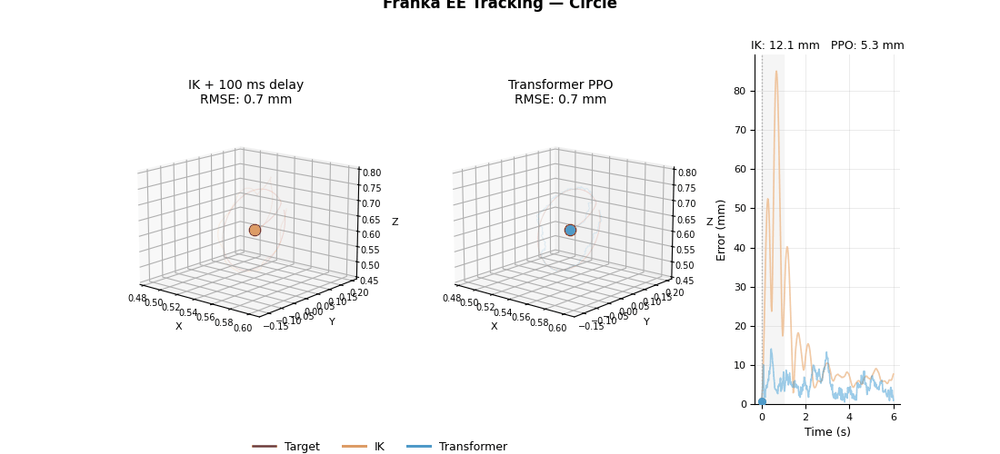
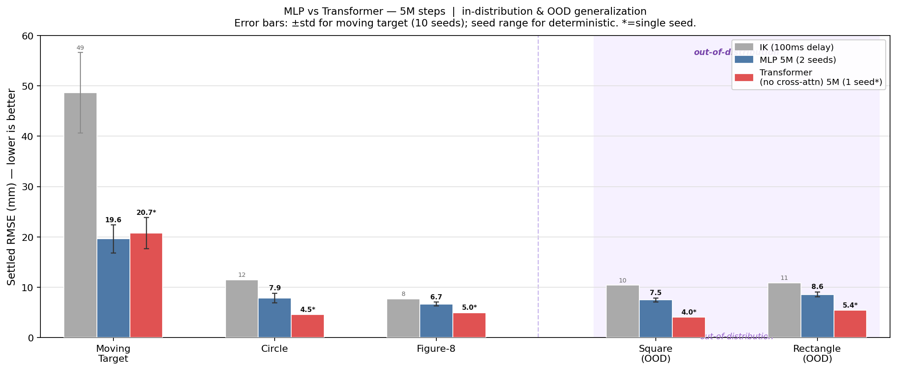
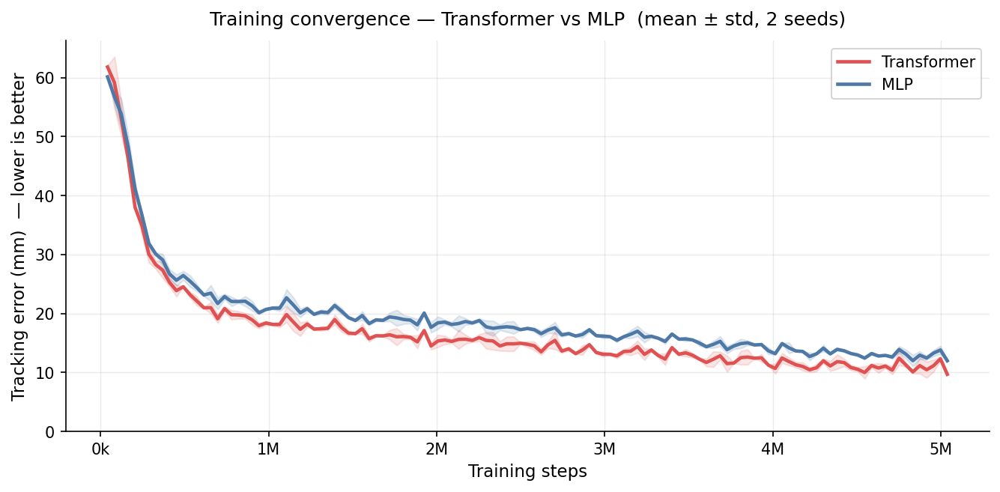
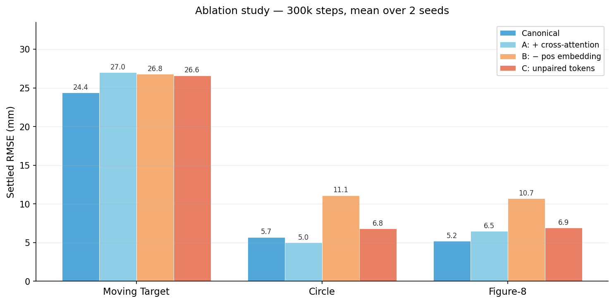

# Franka EE Tracking — Residual PPO with Delay-Aware Transformer

7-DoF Franka Panda end-effector tracking in MuJoCo, trained with residual PPO on top of a damped-least-squares IK baseline. The core challenge is a **5-step (100 ms) whole-pipeline command delay** that causes reactive controllers to systematically lag the target. A transformer policy with delay-aware observations learns predictive corrections the IK cannot make.



---

## Results



Settled RMSE (mm) — lower is better. Shaded regions mark out-of-distribution (OOD) trajectories never seen during training. Error bars: ±SEM.

All results at 5M steps, 2-seed mean. Stochastic tasks (Moving Target: 10 seeds, Step Target: 30 seeds) show mean ± std. †OOD — never seen during training. ‡Roughness = mean $|a_t - a_{t-1}|$ per joint, averaged across MT/CI/F8.

| Model | Moving Target | Circle | Figure-8 | Square† | Rectangle† | Fast Circle† | Step Target† | Roughness‡ |
|---|---|---|---|---|---|---|---|---|
| IK (no delay) | ~18 mm | ~8 mm | ~4 mm | — | — | — | — | — |
| IK (100 ms delay) | 48.6 ± 8.0 mm | 11.5 mm | 7.7 mm | 10.4 mm | 10.9 mm | 31.1 mm | 61.2 ± 12.5 mm | — |
| MLP 5M | 19.6 mm | 7.9 mm | 6.7 mm | 7.5 mm | 8.6 mm | 11.1 mm | 40.3 ± 10.7 mm | 0.60 |
| **Transformer 5M** | **20.6 ± 3.3 mm** | **4.8 mm** | **4.8 mm** | **4.2 mm** | **5.1 mm** | **8.9 mm** | **41.0 ± 11.8 mm** | **0.37** |

**Key results:** On periodic trajectories the transformer is **39% more accurate** on circle (4.8 vs 7.9 mm) and **28% on figure-8** (4.8 vs 6.7 mm). On moving target both models are within noise. The transformer produces **38% smoother** joint commands (roughness 0.37 vs 0.60). OOD shapes show the strongest win — **44% better on square** — because the fine lookahead pre-steers around corners 100 ms early. Step target is essentially tied, both improving ~33% over IK.



---

### Out-of-distribution generalization

The traj-type one-hot is all-zeros at eval time for OOD trajectories. The transformer generalises better to unseen shapes (square, rectangle) because the delay window is most damaging at hard corners — the fine lookahead sees the upcoming turn 100 ms ahead and generates a predictive correction the MLP cannot. At 2× speed (fast circle) the advantage holds (−20%). Step target (random waypoints) is the only task where both models tie, likely because random waypoints share little structure with the smooth training trajectories.

---

## Quickstart

```bash
# 1. Install dependencies
python -m venv .venv && source .venv/bin/activate
pip install -r requirements.txt

# 2. Clone Franka assets
git clone --depth 1 --filter=blob:none --sparse \
    https://github.com/google-deepmind/mujoco_menagerie.git assets/mujoco_menagerie
git -C assets/mujoco_menagerie sparse-checkout set franka_emika_panda
```

**Option A — run with pre-trained weights (no training required):**
```bash
# Evaluate transformer vs IK baseline, all trajectory types
python evaluate.py ablation --model results/canonical/transformer_5M.zip

# Record a tracking video
python record_video.py --model results/canonical/transformer_5M.zip --trajectory circle
```

**Option B — train from scratch (~55 min, 20 parallel envs):**
```bash
python train.py \
    --config ee_tracking/configs/transformer/tfm_no_xattn_5M.yaml \
    --out results/my_run

python evaluate.py ablation --model results/my_run/final_model.zip

tensorboard --logdir results/my_run/tb
```

---

## How it works

A standard IK controller reacts to the *current* target. With a 5-step (100 ms) FIFO delay the command only executes when the target has already moved — causing ~49 mm lag on a random walk, 2.5× the no-delay error. The fix: if the policy sees **where the target will be** when each queued command executes, and **what commands are already queued**, it can add a predictive residual that pre-compensates.

$$q_{\text{set}}(t) = \operatorname{clip}\!\left(q_{\text{ik}}(t) + r(t)\cdot s_r,\; q_{\text{lim}}\right)$$

$$\text{ctrl}(t) = q_{\text{set}}(t - 5) \qquad \text{(whole pipeline delayed 5 steps)}$$

A zero residual always falls back to IK. The 95-D observation is structured around the delay:

| Block | Dims | Content |
|---|---|---|
| Robot state | 30 | Joint positions/velocities, EE position, position error, IK command |
| Fine lookahead | 15 | Target at t+20ms … t+100ms — covers the exact 5-step delay window |
| Coarse lookahead | 12 | Target at t+100ms … t+400ms — trajectory trend |
| Command history | 35 | 5 queued setpoints − current q — prevents stacking redundant corrections |
| Trajectory ID | 3 | One-hot: moving target / circle / figure-8 |

$$r(t) = w_{\text{pos}}\bigl(\|e_{t-1}\| - \|e_t\|\bigr) - w_{\text{vel}}\|\dot{p}_{\text{ee}}\| - w_{\text{res}}\|a_t\|^2$$

No smoothness penalty — the optimal delay-compensation strategy is a predictive impulse, which is inherently discontinuous.

---

## Architecture

### Transformer with paired slot tokens

The transformer processes the delay queue as a sequence of **slot tokens**, where each token pairs the queued command with the fine lookahead target it will execute against:

$$\text{slot}_i = W\!\left[\text{fine}_i \;\|\; \text{cmd}_i\right] \in \mathbb{R}^{d_{\text{model}}}$$

This pairing is the key structural prior. `cmd[i]` will execute when the target is at `fine[i]` — wiring this temporal alignment into the token representation gives the encoder a structure the MLP must discover from scratch.

The slot sequence is processed by a pre-LN TransformerEncoder (2 layers, 4 heads, d_model=64), mean-pooled, and concatenated with the encoded robot state:

```
Observation
    ├── robot_state (30D) ─┐
    ├── coarse_look (12D)  ├─ concat (45D) ──► Linear → state_enc (64D)
    ├── traj_onehot  (3D) ─┘
    └── [fine[i] ‖ cmd[i]] × 5 ──► TransformerEncoder ──► mean pool → slots_enc (64D)
                                                                         │
                                                     concat(state_enc, slots_enc) (128D)
                                                                         │
                                          ┌──────────────────────────────┴──────────────────────┐
                                       Actor MLP                                         Critic MLP
                                    [256, 256] → 7D                              [256, 256, 256] → 1
```

### Ablation study



Core architecture ablation at 300k steps — each variant removes or replaces one component from the canonical (self-attention only, paired tokens, positional embedding):

| Ablation | Moving Target | Circle | Figure-8 | Conclusion |
|---|---|---|---|---|
| **Canonical (self-attn, no xattn)** | **24.4 mm** | **5.7 mm** | **5.2 mm** | — baseline |
| A: − positional embedding | 26.8 mm | 11.1 mm | 10.7 mm | PE critical for periodic trajectories |
| B: + cross-attention layers | 27.0 mm | 5.0 mm | 6.5 mm | xattn hurts MT and F8 |
| C: unpaired tokens | 26.6 mm | 6.8 mm | 6.9 mm | pairing helps all trajectories |

See [**full ablation study and architecture explorations**](docs/ablations.md) for per-seed detail, v2 architecture variants (MLP projection, reactive bypass, attention pooling), hyperparameter sensitivity (residual scale, LR schedule, PPO settings), and action filter experiments.

---

## Repository structure

```
ee_tracking/
  env/
    franka_tracking_env.py   # Gymnasium env — obs, reward, delay FIFO
    ik_controller.py         # Damped least-squares IK baseline
    trajectories.py          # circle, figure-8, moving_target generators
    disturbances.py          # noise + command delay
  policies/
    transformer_policy.py    # Paired-slot transformer (SB3-compatible)
    gelu_policy.py           # MLP with GELU + LayerNorm
    delay_buffer.py          # FIFO delay buffer
  configs/
    mlp/                     # MLP configs (mlp_best_10M.yaml = champion MLP)
    transformer/             # Transformer configs + ablations

train.py                     # Train from YAML config
evaluate.py                  # IK vs policy evaluation + plots
sweep.py                     # Hyperparameter sweep runner
record_video.py              # Record tracking video

docs/architecture.md         # Full architecture diagrams (Mermaid)
docs/ablations.md            # Full ablation study & experiment log
scripts/make_figures.py      # Generate result figures
scripts/show_results.py      # Terminal results viewer
```

---

## Acknowledgements

Franka Panda model from [MuJoCo Menagerie](https://github.com/google-deepmind/mujoco_menagerie).
Training via [Stable-Baselines3](https://github.com/DLR-RM/stable-baselines3).
