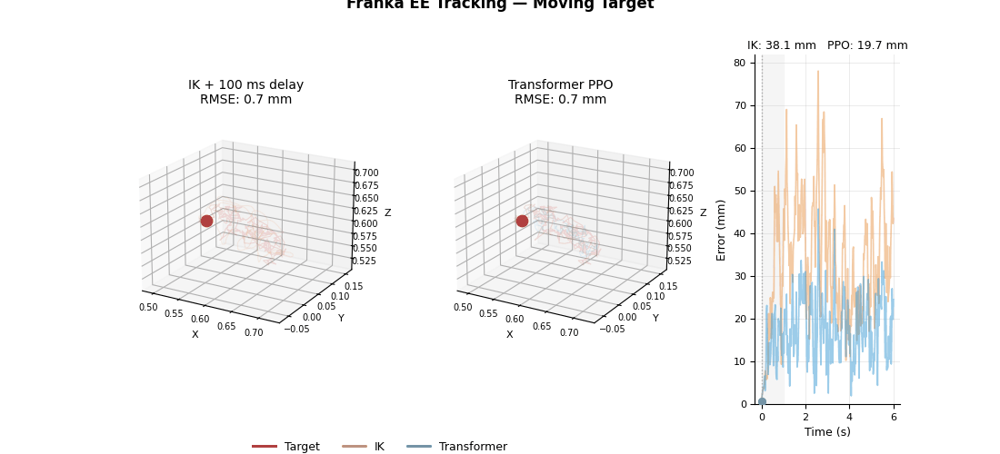
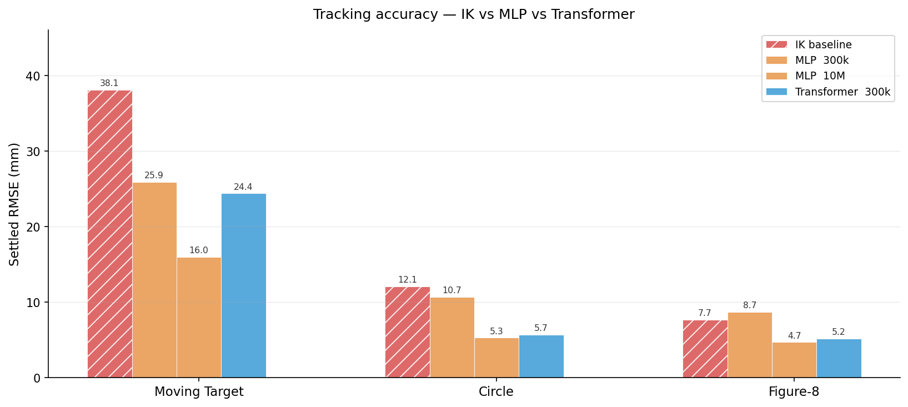

# Franka EE Tracking — Residual PPO with Delay-Aware Transformer

7-DoF Franka Panda end-effector tracking in MuJoCo, trained with residual PPO on top of a damped-least-squares IK baseline. The core challenge is a **5-step (100 ms) whole-pipeline command delay** that causes reactive controllers to systematically lag the target. A transformer policy with delay-aware observations learns predictive corrections the IK cannot make.



---

## Results



Settled RMSE (mm) — lower is better. All 300k rows evaluated on a single fixed seed (seed=42) for consistency with ablations. †Moving target (random walk) is stochastic: single-seed values; see rigorous multi-seed table below.

| Model | Steps | Moving Target† | Circle | Figure-8 |
|---|---|---|---|---|
| IK baseline (no delay) | — | ~18 mm | ~8 mm | ~4 mm |
| **IK baseline (100 ms delay)** | — | **38.1 mm** | **12.1 mm** | **7.7 mm** |
| MLP | 300k | 25.9 mm | 10.7 mm | 8.7 mm |
| MLP | 5M | 21.0 mm | 7.6 mm | 7.0 mm |
| MLP | 10M | 16.0 mm | 5.3 mm | 4.7 mm |
| Transformer (base) | 300k | 27.0 mm | 5.0 mm | 6.5 mm |
| **Transformer (no cross-attn)** | **300k** | **23.6 mm** | **4.9 mm** | **4.8 mm** |
| **Transformer (no cross-attn)** | **5M** | **19.7 mm** | **5.3 mm** | **6.0 mm** |

**Key result:** The transformer at 300k steps matches the MLP at 10M steps on circular and figure-8 trajectories — a **33× step efficiency advantage**.


---

### Rigorous 5M comparison (multi-seed)

For the final 5M models, moving-target RMSE is averaged over 10 random-walk seeds; circle and figure-8 are deterministic. Smoothness metrics are computed over the settled portion of each episode.

| Model | Moving Target | Circle | Figure-8 |
|---|---|---|---|
| IK (100 ms delay) | 48.6 ± 8.0 mm | 11.5 mm | 7.7 mm |
| MLP 5M (mean, 2 seeds) | 19.6 mm | 7.9 mm | 6.7 mm |
| **Transformer 5M (seed=42)** | **20.7 ± 3.1 mm** | **4.5 mm** | **5.0 mm** |

| Model | Action roughness¹ | Saturation rate² |
|---|---|---|
| MLP 5M (mean, 2 seeds) | 0.796 / 0.472 / 0.520 | 44.8% / 56.5% / 58.0% |
| **Transformer 5M (seed=42)** | **0.614 / 0.279 / 0.292** | **28.9% / 55.1% / 45.2%** |

¹ Mean \|a_t − a_{t−1}\| per joint per step (MT / CI / F8). Lower = smoother commands.  
² Fraction of (timestep × joint) pairs where \|action\| > 0.9 (MT / CI / F8). Lower = less bang-bang.

On periodic trajectories (circle, figure-8) the transformer is **43% and 25% more accurate** than the MLP at the same training budget. On the random-walk trajectory both are within noise (20.7 vs 19.6 mm). The transformer also produces smoother joint commands: 20–45% lower roughness across all trajectories.

---

### Out-of-distribution generalization (square, rectangle)

Tested on trajectories **never seen during training** (traj-type one-hot is all-zeros at eval time):

| Trajectory | IK | MLP 5M (best seed) | **Transformer 5M** |
|---|---|---|---|
| Square | 10.6 mm | 6.8 mm | **4.9 mm** |
| Rectangle | 9.4 mm | 7.1 mm | **4.8 mm** |

The transformer generalizes ~30% better than the best MLP seed on OOD shapes.

---

## Quickstart

```bash
# 1. Install dependencies
python -m venv .venv && source .venv/bin/activate
pip install -r requirements.txt

# 2. Clone Franka assets
git clone --depth 1 --filter=blob:none --sparse \
    https://github.com/google-deepmind/mujoco_menagerie.git assets/mujoco_menagerie
git -C assets/mujoco_menagerie sparse-checkout set franka_emika_panda

# 3. Train best model (~55 min, 20 parallel envs)
python train.py \
    --config ee_tracking/configs/transformer/tfm_no_xattn_5M.yaml \
    --out results/my_run

# 4. Evaluate (IK vs policy table + trajectory plots)
python evaluate.py ablation --model results/my_run/final_model.zip

# 5. View training curves
tensorboard --logdir results/my_run/tb
```

---

## Approach

### The delay problem

A standard IK controller commands joint positions based on the *current* measured target. With a 5-step FIFO delay (100 ms round-trip), that command only executes when the target has already moved. On a fast random-walk trajectory this causes ~38 mm lag — more than double the no-delay IK error.

The key insight: the delay window is known and fixed. If the policy can see both **where the target will be** when each queued command executes, and **what commands are already queued**, it can add a predictive correction that pre-compensates for the lag.

### Residual control

The policy outputs a **residual** on top of IK, not a full joint position command:

```
q_set(t) = clip(q_ik(t) + residual(t) × residual_scale, joint_limits)
ctrl(t)  = q_set(t − 5)          ← whole pipeline delayed 5 steps
```

An untrained policy (residual ≈ 0) degrades gracefully to IK — the baseline is always available. The IK handles gross positioning; the residual only needs to learn the predictive delay-compensation correction.

### Observation design

The 95-D observation is structured around the delay:

| Block | Dims | Content |
|---|---|---|
| Robot state | 30 | Joint positions/velocities, EE position, position error, IK command |
| Fine lookahead | 15 | Target position at t+20ms … t+100ms — covers exact delay window |
| Coarse lookahead | 12 | Target position at t+100ms … t+400ms — trajectory trend |
| Command history | 35 | 5 queued setpoints minus current q — Markov restoring element |
| Trajectory ID | 3 | One-hot: moving target / circle / figure-8 |

The fine lookahead window covers exactly the 5-step delay. The command history reveals what corrections are already queued, preventing the policy from stacking redundant commands.

---

## Architecture

### Transformer with paired slot tokens

The transformer processes the delay queue as a sequence of **slot tokens**, where each token pairs the queued command with the fine lookahead target it will execute against:

```
slot[i] = Linear(concat(fine_lookahead[i], cmd_history[i]))  →  d_model
```

This pairing is the key structural prior. `cmd[i]` will execute when the target is at `fine[i]` — wiring this temporal alignment into the token representation gives the encoder a structure the MLP must discover from scratch.

The slot sequence is processed by a pre-LN TransformerEncoder (2 layers, 4 heads, d_model=64), mean-pooled, and concatenated with the encoded robot state:

```
Observation
    ├── robot_state (30D) ─┐
    ├── coarse_look (12D)  ├─ concat (45D) ──► Linear → state_enc (64D)
    ├── traj_onehot  (3D) ─┘
    └── [fine[i] ‖ cmd[i]] × 5 ──► TransformerEncoder ──► mean pool → slots_enc (64D)
                                                                         │
                                                     concat(state_enc, slots_enc) (128D)
                                                                         │
                                          ┌──────────────────────────────┴──────────────────────┐
                                       Actor MLP                                         Critic MLP
                                    [256, 256] → 7D                              [256, 256, 256] → 1
```

### Ablation study


Ablations at 300k steps identify which components matter:

| Ablation | Moving Target | Circle | Figure-8 | Conclusion |
|---|---|---|---|---|
| Full model (baseline) | 27.0 mm | 5.0 mm | 6.5 mm | — |
| A: no positional embedding | 26.8 mm | 11.1 mm | 10.7 mm | PE critical for periodic trajectories |
| B: no cross-attention | 24.4 mm† | 5.7 mm† | 5.2 mm† | xattn redundant — paired tokens sufficient |
| C: unpaired tokens | 26.6 mm‡ | 6.8 mm‡ | 6.9 mm‡ | pairing helps periodic trajectories |

† mean over 2 seeds (seed=42: MT=23.6 CI=4.9 F8=4.8; seed=1: MT=25.2 CI=6.5 F8=5.5)
‡ mean over 2 seeds (seed=42: MT=25.9 CI=5.9 F8=5.9; seed=1: MT=27.2 CI=7.7 F8=7.8)

**Finding B:** Removing cross-attention *improves* the model on all trajectories. The paired token design already encodes the temporal alignment that cross-attention was meant to learn, making it redundant. The best model uses pure self-attention with no cross-attention layers.

**Finding C:** Unpairing the tokens degrades CI by +1.8 mm and F8 by +0.4 mm on average. The `cmd[i]↔fine[i]` pairing is the key structural prior — it wires the temporal alignment directly into the encoder input rather than requiring the model to discover it.

---

## Design choices

### State and action space

**State (95D):** Concatenates current robot state, oracle future target positions (fine + coarse lookahead), and the pending command queue. The command history is essential for the Markov property: without it the policy cannot distinguish "IK is already compensating" from "nothing is queued" and stacks redundant corrections.

**Action (7D):** Per-joint position residuals in [−1, 1], scaled by `residual_scale = 0.12 rad`. A zero action always falls back to IK.

### Reward

```
r = w_pos × (‖err_prev‖ − ‖err_now‖)   # reward progress toward target
  − w_vel × ‖ee_vel‖                    # penalise unnecessary motion
  − w_residual × ‖action‖²              # small regularisation on residual
```

No jerk or smoothness penalty. With a 5-step delay the optimal strategy is a *predictive impulse* — inherently discontinuous. Penalising action changes directly penalises the delay-compensation mechanism.

### Trajectory representation

Three trajectory types trained simultaneously:
- **Moving target** — band-limited random walk (0.05–0.15 Hz, 8–14 cm amplitude)
- **Circle** — constant-speed circular orbit
- **Figure-8** — Lissajous curve with direction reversals

Training with a mixed pool was essential: single-trajectory training overfits and degrades on held-out trajectories.

### Evaluation metric

`residual_settled_rmse_mm`: RMSE of the EE position error over the settled portion of each episode (after 0.5 s), per trajectory type. Separates steady-state tracking from transient startup.

### Uncertainty sources

| Source | Implementation |
|---|---|
| Observation noise | Gaussian on EE position (σ=5 mm) and joint positions (σ=2 mm) |
| Command delay | 5-step FIFO applied to the full IK+residual setpoint (100 ms) |
| Unreachable positions | Episode terminates at 0.30 m tracking error; included as an eval scenario |

---

## Repository structure

```
ee_tracking/
  env/
    franka_tracking_env.py   # Gymnasium env — obs, reward, delay FIFO
    ik_controller.py         # Damped least-squares IK baseline
    trajectories.py          # circle, figure-8, moving_target generators
    disturbances.py          # noise + command delay
  policies/
    transformer_policy.py    # Paired-slot transformer (SB3-compatible)
    gelu_policy.py           # MLP with GELU + LayerNorm
    delay_buffer.py          # FIFO delay buffer
  configs/
    mlp/                     # MLP configs (mlp_best_10M.yaml = champion MLP)
    transformer/             # Transformer configs + ablations

train.py                     # Train from YAML config
evaluate.py                  # IK vs policy evaluation + plots
sweep.py                     # Hyperparameter sweep runner
record_video.py              # Record tracking video

docs/architecture.md         # Full architecture diagrams (Mermaid)
scripts/make_figures.py      # Generate result figures
scripts/show_results.py      # Terminal results viewer
```

---

## Acknowledgements

Franka Panda model from [MuJoCo Menagerie](https://github.com/google-deepmind/mujoco_menagerie).
Training via [Stable-Baselines3](https://github.com/DLR-RM/stable-baselines3).
