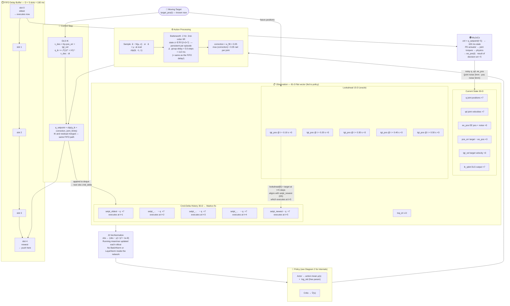
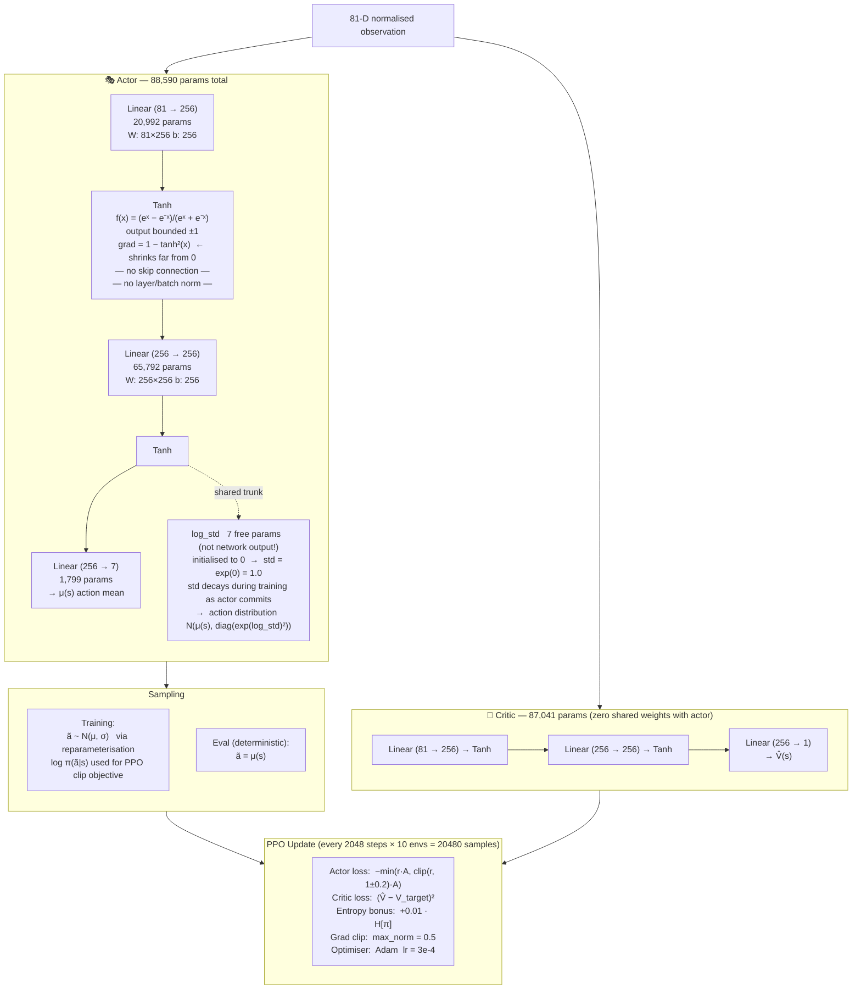
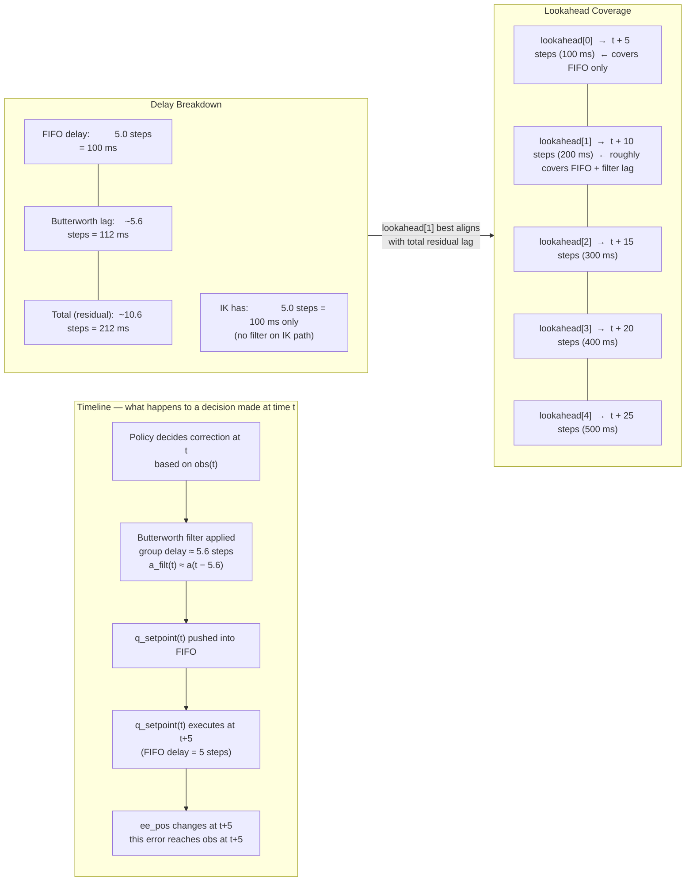

# Architecture Diagrams

## 1 — Full Control Pipeline

```mermaid
flowchart TD
    TGT(["🎯 Moving Target\ntarget_pos(t) — known now"])

    subgraph OBS["📋 Observation — 81-D flat vector  (fed to policy)"]
        direction LR

        subgraph STATE["Current State  30-D"]
            S1["q         joint positions  ×7"]
            S2["qd        joint velocities ×7"]
            S3["ee_pos    EE pos + noise   ×3"]
            S4["pos_err   target − ee_pos  ×3"]
            S5["tgt_vel   target velocity  ×3"]
            S6["ik_qdot   DLS output       ×7"]
        end

        subgraph LOOK["Lookahead  15-D  (oracle)"]
            L1["tgt_pos @ t + 0.10 s  ×3"]
            L2["tgt_pos @ t + 0.20 s  ×3"]
            L3["tgt_pos @ t + 0.30 s  ×3"]
            L4["tgt_pos @ t + 0.40 s  ×3"]
            L5["tgt_pos @ t + 0.50 s  ×3"]
        end

        subgraph CMDDELTA["Cmd-Delta History  35-D  ← Markov fix"]
            D1["setpt_oldest − q  ×7   executes at t+1"]
            D2["setpt_...    − q  ×7   executes at t+2"]
            D3["setpt_...    − q  ×7   executes at t+3"]
            D4["setpt_...    − q  ×7   executes at t+4"]
            D5["setpt_newest − q  ×7   executes at t+5"]
        end

        TJ["traj_id  1-D"]
    end

    VN["⚖️ VecNormalize\nobs ← (obs − μ̂) / (σ̂ + 1e-8)\nRunning mean/var updated each rollout\nNo BatchNorm or LayerNorm inside the network"]

    subgraph POLICY["🧠 Policy  (see Diagram 2 for internals)"]
        ACT["Actor → action mean μ(s)  +  log_std (free param)"]
        CRIT["Critic → V̂(s)"]
    end

    subgraph ACTPROC["⚙️ Action Processing"]
        SAMP["Sample  ã ~ N(μ, σ)   or   ã = μ  at eval\nclip(ã, −1, 1)"]
        BWTH["Butterworth  2 Hz  2nd-order IIR\nstate zi ∈ ℝ^(2×2×7)  — persistent per episode\n⚠️  group delay ≈ 5.6 steps = 112 ms\n    (≈ same as the FIFO delay!)"]
        SCALE["correction = a_filt × 0.05\nmax |correction| = 0.05 rad per joint"]
        SAMP --> BWTH --> SCALE
    end

    subgraph CTRLSTEP["🤖 Control Step"]
        IKC["DLS IK\nv_des = Kp·pos_err + tgt_vel\nq_ik += Jᵀ(JJᵀ + λ²I)⁻¹ v_des · dt"]
        MERGE["q_setpoint = clip(q_ik + correction, joint_limits)\nIK and residual merged — same FIFO path"]
    end

    subgraph FIFO["⏱️ FIFO Delay Buffer  —  D = 5 slots = 100 ms"]
        direction LR
        F0["slot 0\noldest\n→ executes now"] --> F1["slot 1"] --> F2["slot 2"] --> F3["slot 3"] --> F4["slot 4\nnewest\n← push here"]
    end

    MJC["🌍 MuJoCo\nctrl = q_setpoint(t−5)   ← 100 ms stale\nPD actuator → joint torques → physics\n→ ee_pos(t)   result of decision at t−5"]

    %% ── main data flow ─────────────────────────────────────────
    TGT -->|"future positions"| LOOK
    TGT --> IKC

    OBS --> VN --> POLICY
    POLICY --> ACTPROC
    ACTPROC --> MERGE
    IKC --> MERGE
    MERGE --> F4
    F0 --> MJC

    MJC -->|"noisy q, qd, ee_pos\n(joint noise 2mm · pos noise 5mm)"| STATE
    MERGE -->|"append to deque\n→ next obs cmd_delta"| CMDDELTA

    %% ── delay alignment note ────────────────────────────────────
    L1 -. "lookahead[0] = target at t+5 steps\naligns with setpt_newest (D5)\nwhich executes at t+5" .-> D5
```

---

## 2 — MLP Architecture (Actor + Critic)

```mermaid
flowchart TD
    IN["81-D normalised observation"]

    subgraph ACTOR["🎭 Actor  —  88,590 params total"]
        direction TB
        AL1["Linear (81 → 256)\n20,992 params\nW: 81×256   b: 256"]
        AT1["Tanh\nf(x) = (eˣ − e⁻ˣ)/(eˣ + e⁻ˣ)\noutput bounded ±1\ngrad = 1 − tanh²(x)  ← shrinks far from 0\n— no skip connection —\n— no layer/batch norm —"]
        AL2["Linear (256 → 256)\n65,792 params\nW: 256×256   b: 256"]
        AT2["Tanh"]
        AMEAN["Linear (256 → 7)\n1,799 params\n→  μ(s)   action mean"]
        ASTD["log_std   7 free params  (not network output!)\ninitialised to 0  →  std = exp(0) = 1.0\nstd decays during training as actor commits\n→  action distribution  N(μ(s), diag(exp(log_std)²))"]

        AL1 --> AT1 --> AL2 --> AT2 --> AMEAN
        AT2 -.->|"shared trunk"| ASTD
    end

    subgraph CRITIC["🧮 Critic  —  87,041 params  (zero shared weights with actor)"]
        direction LR
        CL1["Linear (81 → 256)  →  Tanh"]
        CL2["Linear (256 → 256)  →  Tanh"]
        CV["Linear (256 → 1)\n→  V̂(s)"]
        CL1 --> CL2 --> CV
    end

    subgraph SAMPLE["Sampling"]
        direction TB
        STRAIN["Training:\nã ~ N(μ, σ)   via reparameterisation\nlog π(ã|s) used for PPO clip objective"]
        SEVAL["Eval  (deterministic):\nã = μ(s)"]
    end

    subgraph PPO["PPO Update  (every 2048 steps × 10 envs = 20480 samples)"]
        direction LR
        LOSS["Actor loss:  −min(r·A, clip(r, 1±0.2)·A)\nCritic loss:  (V̂ − V_target)²\nEntropy bonus:  +0.01 · H[π]\nGrad clip:  max_norm = 0.5\nOptimiser:  Adam  lr = 3e-4"]
    end

    IN --> ACTOR
    IN --> CRITIC
    ACTOR --> SAMPLE
    SAMPLE --> PPO
    CRITIC --> PPO
```

---

## 3 — Delay Impact: What the Policy Compensates

```mermaid
flowchart LR
    subgraph TIMELINE["Timeline — what happens to a decision made at time t"]
        direction TB

        PT["Policy decides correction at t\nbased on obs(t)"]
        BW["Butterworth filter applied\ngroup delay ≈ 5.6 steps\na_filt(t) ≈ a(t − 5.6)"]
        QS["q_setpoint(t) pushed into FIFO"]
        EX["q_setpoint(t) executes at t+5\n(FIFO delay = 5 steps)"]
        EE["ee_pos changes at t+5\nthis error reaches obs at t+5"]

        PT --> BW --> QS --> EX --> EE
    end

    subgraph BREAKDOWN["Delay Breakdown"]
        direction TB
        DLY1["FIFO delay:          5.0 steps = 100 ms"]
        DLY2["Butterworth lag:    ~5.6 steps = 112 ms"]
        DLY3["Total (residual):  ~10.6 steps = 212 ms"]
        DLY4["IK has:             5.0 steps = 100 ms only\n(no filter on IK path)"]
        DLY1 --- DLY2 --- DLY3
        DLY4
    end

    subgraph COVERAGE["Lookahead Coverage"]
        direction TB
        LA0["lookahead[0]  →  t + 5  steps (100 ms)  ← covers FIFO only"]
        LA1["lookahead[1]  →  t + 10 steps (200 ms)  ← roughly covers FIFO + filter lag"]
        LA2["lookahead[2]  →  t + 15 steps (300 ms)"]
        LA3["lookahead[3]  →  t + 20 steps (400 ms)"]
        LA4["lookahead[4]  →  t + 25 steps (500 ms)"]
        LA0 --- LA1 --- LA2 --- LA3 --- LA4
    end

    BREAKDOWN -->|"lookahead[1] best aligns\nwith total residual lag"| COVERAGE
```
