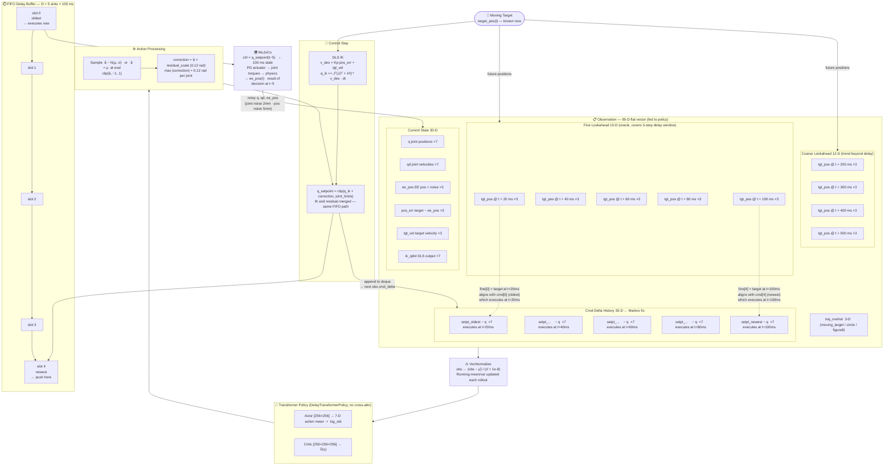
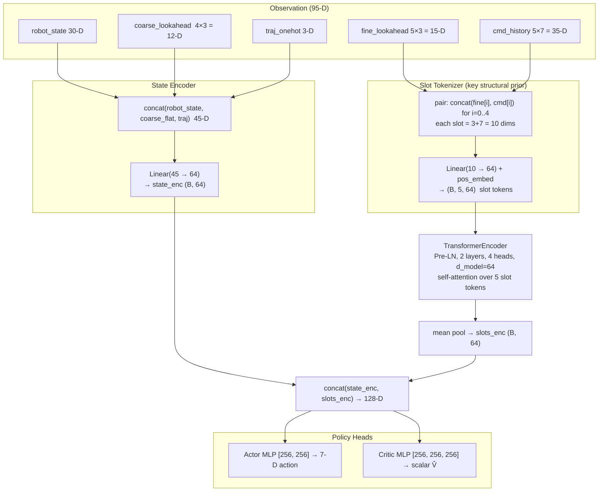
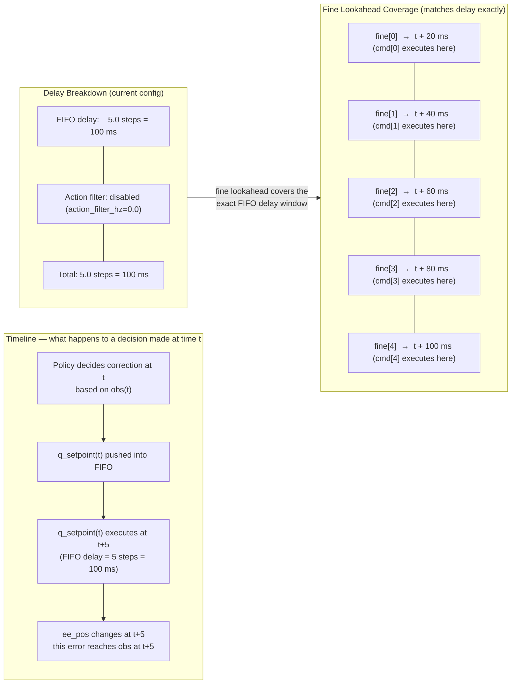

# Architecture Diagrams

> **Current canonical architecture:** `DelayTransformerPolicy` (no cross-attention).
> See `README.md` for the up-to-date architecture diagram and description.
> The transformer architecture diagram is at `results/figures/transformer_architecture.png`.
>
> The Mermaid diagrams below document the **full control pipeline** (§1) and
> the legacy **MLP architecture** (§2–3) which is kept for historical reference.

---

## 1 — Full Control Pipeline

The residual PPO policy outputs a 7-D correction on top of damped-least-squares IK.
Both IK and residual travel through the same FIFO delay buffer.

---

## 2 — Transformer Architecture (canonical, no cross-attention)

See `results/figures/transformer_architecture.png` for the rendered diagram.

**Key insight:** `cmd[i]` executes when the target is at `fine[i]`. Pairing them into
one slot token makes this temporal causal link explicit — the encoder can immediately
act on the cmd↔fine residual. Cross-attention was removed (Ablation B) because the
pairing already encodes the alignment cross-attention would have learned.

---

## 3 — Delay Impact: What the Policy Compensates

